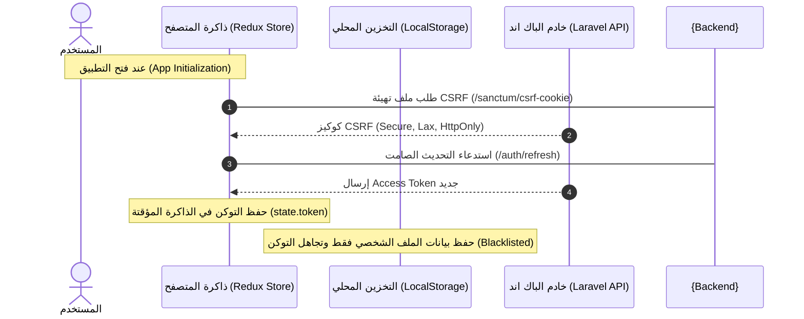

# دليل توثيق وهندسة الفرونت اند التفصيلي لمنصة فايكا (Detailed Vayka Frontend Documentation) 💻

مرحباً بك في دليل التوثيق الهندسي والفني الشامل لتطبيق الواجهة الأمامية (Frontend) لمشروع **فايكا (Vayka)** لحجز الفنادق. تم تصميم هذا التطبيق وهندسته باستخدام أحدث التقنيات البرمجية لتوفير بيئة عمل آمنة، سريعة، وسلسة تمنح المستخدم تجربة تصفح وحجز استثنائية.

---

## 🛠️ 1. التقنيات والمكتبات المستخدمة (Technical Stack)

يعتمد تطبيق الفرونت اند على بيئة عمل حديثة ومستقرة:

*   **React 19.2**: النسخة الأحدث من مكتبة React التي تقدم أداءً ممتازاً وهياكل محسنة لمعالجة واجهات المستخدم.
*   **Vite 7.2**: خادم التطوير والمُجمّع (Bundler) فائق السرعة لدعم التطوير اللحظي (HMR).
*   **Redux Toolkit (RTK) 2.11 & React Redux 9.2**: لإدارة الحالة العامة للتطبيق بشكل منظم وقابل للتوقع.
*   **Redux Toolkit Query (RTK Query)**: لإدارة جلب البيانات والتواصل مع الـ API بكفاءة عالية، مع تفعيل كاش ذكي يدعم تحديث وحذف البيانات تلقائياً (Cache Invalidation).
*   **Redux Persist 6.0**: لحفظ أجزاء محددة من حالة التطبيق في الذاكرة الدائمة (`localStorage`) مع تفعيل حظر للبيانات الحساسة.
*   **React Router DOM 7.9**: لإدارة نظام التوجيه والمسارات داخل التطبيق الأحادي الصفحة (SPA).
*   **Tailwind CSS v4.1 & @tailwindcss/vite**: الإصدار الأحدث من مكتبة التنسيق السريع والمبني مباشرة في Vite للحصول على سرعة بناء خارقة وتنسيق عصري.
*   **Stripe Elements (@stripe/react-stripe-js & @stripe/stripe-js)**: لمعالجة مدفوعات بطاقات الائتمان بشكل آمن بالكامل على جهة العميل.
*   **Firebase 12.10**: للاتصال بخدمات Firebase Cloud Messaging (FCM) واستقبال الإشعارات الفورية.
*   **Framer Motion 12.2**: لإضافة الحركات والتأثيرات الانتقالية السلسة لجميع النوافذ والبطاقات.
*   **Yup & Formik**: للتحقق من صحة المدخلات وإدارة النماذج (Forms) بشكل متكامل.

---

## 🗺️ 2. هيكل المجلدات وشرح محتوياتها بالتفصيل (Detailed Folder Structure)

يتوزع منطق التطبيق البرمجي على مجلدات مخصصة تضمن فصل المهام (Separation of Concerns):

```
src/
├─ assets/                # الخطوط، الصور الثابتة والتأثيرات المرئية الخاصة بالفنادق
├─ components/            # المكونات المشتركة القابلة لإعادة الاستخدام
│   ├─ auth/              # النوافذ المنبثقة للتسجيل، تسجيل الدخول ورموز الـ OTP
│   │   ├─ forms/         # نماذج إدخال البريد، كلمة المرور، ورمز التحقق
│   │   ├─ AuthChecker.jsx# صمام الأمان وإطلاق التجديد الصامت والتسجيل في الإشعارات
│   │   └─ AuthOverlay.jsx# مراقبة المسارات وعرض النوافذ كمودال Overlay
│   ├─ common/            # المكونات العامة مثل شريط البحث الذكي وأدوات التقييم
│   ├─ layout/            # التنسيقات العامة (المظهر الأساسي، مظهر لوحة التحكم)
│   └─ ui/                # عناصر الواجهات البسيطة والـ ChatWidget التفاعلي
├─ context/               # السياقات العامة (مثل ThemeContext للتحكم بالوضع الليلي)
├─ pages/                 # الصفحات الأساسية للتطبيق التي تظهر عند تغيير المسار
│   ├─ Home/              # الصفحة الرئيسية واستعراض الفنادق المميزة وعروض نهاية الأسبوع
│   ├─ Explore/           # محرك البحث وفلترة الفنادق والتحكم بالنطاقات السعرية
│   ├─ Rooms/             # استعراض الغرف المتاحة داخل فندق معين
│   ├─ RoomDetails/       # صفحة تفاصيل الغرفة والصور والتقييمات
│   ├─ BookingConfirmation/# تأكيد الحجز وإعداد الدفع مع Stripe
│   ├─ Payment/           # شاشة الدفع الآمنة
│   ├─ PaymentSuccess/    # نجاح عملية الدفع وتحميل الفاتورة PDF
│   ├─ Favorites/         # الفنادق المفضلة للمستخدم
│   ├─ MyBookings/        # سجل حجوزات المستخدم
│   └─ personalDataForm/  # الملف الشخصي وتحديث البيانات
├─ services/              # طبقة الاتصال بخوادم الـ API والإشعارات
│   ├─ api.js             # الاتصال الأساسي بالمصادقة وإدارة الحساب
│   ├─ hotelsApi.js       # جلب الفنادق وتقييماتها
│   ├─ bookingsApi.js     # إنشاء وإلغاء الحجوزات
│   ├─ paymentsApi.js     # إنشاء وتأكيد الدفع
│   ├─ firebase.js        # إعدادات استقبال توكن الإشعارات FCM
│   └─ ...                # بقية خدمات الـ API المتخصصة
├─ store/                 # إعداد متجر الـ Redux
│   ├─ slices/            # شرائح الحالة (authSlice للحالة الأمنية و notificationSlice)
│   └─ store.js           # تجميع المتجر وإعداد الحفظ التلقائي والـ Middleware
└─ App.jsx                # نقطة البداية للمسارات وتهيئة ملفات الـ CSRF
```

---

## 🛡️ 3. نظام المصادقة وإدارة الجلسات والأمان (Authentication & Security Deep-Dive)

يعتبر الأمان هو الأولوية القصوى في تطبيق **فايكا**، ولذلك تم هندسة نظام مصادقة خالي من الثغرات الأمنية الشائعة.



### 🔒 3.1 سياسة حظر التوكنات من التخزين المحلي (Token Blacklisting)

*   **المشكلة الأمنية**: تخزين توكن الوصول (Access Token) في `localStorage` أو `sessionStorage` يجعله فريسة سهلة في حال نجاح هجوم **حقن النصوص البرمجية (XSS)**، حيث يمكن لأي مكتبة خارجية مخترقة قراءة التخزين المحلي فوراً وإرساله للمهاجم.
*   **الحل الهندسي المتبع**: يتم تخزين التوكن في حقل الـ `token` داخل شريحة [authSlice.js](file:///c:/Users/dell/Desktop/Files/Hotel-client/src/store/slices/authSlice.js) في ذاكرة المتصفح المؤقتة (RAM) فقط.
*   **أمان Redux Persist**: عند إعداد حفظ الجلسة في ملف [store.js](file:///c:/Users/dell/Desktop/Files/Hotel-client/src/store/store.js)، تم إدراج الـ `token` في القائمة السوداء (Blacklist):
    ```javascript
    const authPersistConfig = {
      key: 'auth',
      storage,
      blacklist: ['token'], // يُمنع منعاً باتاً تخزين توكن الوصول في الـ localStorage
    };
    ```
    بهذه الطريقة، يتم حفظ البيانات العامة مثل الاسم والصورة لتسريع تجربة المستخدم، بينما يتم إبقاء التوكن بأعلى درجات الأمان في الذاكرة المؤقتة.

### 🍪 3.2 آلية التحديث الصامت والتثبيت (Silent Refresh Flow)

بما أن التوكن يختفي بمجرد تحديث الصفحة، تم بناء آلية **Tightly Coupled Silent Refresh**:
1. عند تشغيل التطبيق، يتحقق مكون [AuthChecker.jsx](file:///c:/Users/dell/Desktop/Files/Hotel-client/src/components/auth/AuthChecker.jsx) من غياب التوكن عن الذاكرة.
2. يتم توجيه طلب صامت من خلال دالة التحديث `refresh` المحددة بـ `useRefreshMutation` إلى الباك اند عبر المسار `/api/auth/refresh`.
3. وبفضل خيار `credentials: 'include'` الذي تم ضبطه في [api.js](file:///c:/Users/dell/Desktop/Files/Hotel-client/src/services/api.js):
   ```javascript
   credentials: 'include' // يقوم المتصفح تلقائياً بإرسال كوكيز refresh_token الخاصة بـ Sanctum
   ```
   يتحقق الباك اند من الكوكيز الأمنية المحمية بـ `HttpOnly` ويصدر توكن وصول جديد يتم حقنه مباشرة بالذاكرة.

### 🍪 3.3 الحماية ضد ثغرات تزوير الطلبات عبر المواقع (CSRF Protection)

تتطلب جميع طلبات الكتابة والتسجيل (POST, PUT, DELETE) وجود ترويسة حماية ضد الـ CSRF.
*   **البداية**: عند إقلاع التطبيق لأول مرة في [App.jsx](file:///c:/Users/dell/Desktop/Files/Hotel-client/src/App.jsx)، يتم استدعاء دالة التهيئة تلقائياً:
    ```javascript
    useEffect(() => {
      fetch('/sanctum/csrf-cookie', {
        credentials: 'include',
      }).catch(() => {});
    }, []);
    ```
*   تقوم هذه الخطوة بطلب كوكيز `XSRF-TOKEN` من السيرفر. ويتولى المتصفح تلقائياً التقاط هذه الكوكيز وإعادة إرسالها كترويسة `X-XSRF-TOKEN` في الطلبات اللاحقة لضمان أن الطلب صادر من واجهتنا الرسمية حصرياً وليس من موقع خبيث خارجي.

---

## 📡 4. الاتصال بالشبكة وإدارة الكاش (RTK Query & APIs Services)

تم تقسيم خدمات الشبكة إلى ملفات متخصصة بدلاً من حصرها في ملف واحد لضمان سهولة التطوير والصيانة:

1.  **[api.js](file:///c:/Users/dell/Desktop/Files/Hotel-client/src/services/api.js) (المصادقة وإدارة الحساب)**:
    *   يدير عمليات التسجيل، تسجيل الدخول التقليدي والـ OTP، المصادقة عبر Google، وتحديث بيانات البروفايل والصور.
2.  **[hotelsApi.js](file:///c:/Users/dell/Desktop/Files/Hotel-client/src/services/api.js)**:
    *   يدير عمليات البحث والفلترة الذكية للفنادق والغرف، جلب التقييمات والمفضلة.
3.  **[bookingsApi.js](file:///c:/Users/dell/Desktop/Files/Hotel-client/src/services/bookingsApi.js)**:
    *   يدير عمليات التحقق من المتاحية وتثبيت الحجز وإلغائه.
4.  **[paymentsApi.js](file:///c:/Users/dell/Desktop/Files/Hotel-client/src/services/paymentsApi.js)**:
    *   يدير عمليات تأسيس الدفع وتأكيده مع Stripe.

### 🏷️ 4.1 إدارة الكاش والوسوم الذكية (Tags & Cache Invalidation)
تستخدم خدمات الـ API نظام الوسوم (Tags) لضمان تحديث الواجهات تلقائياً عند تغيير البيانات دون الحاجة لإعادة تحميل الصفحة بالكامل.
*   عند تحديث الملف الشخصي أو رفع صورة بروفايل جديدة، يتم تفعيل وسوم `invalidatesTags: ['User']` مما يجبر RTK Query على إعادة طلب بيانات المستخدم الحالية وتحديث الشريط العلوي وصورته فوراً.
*   عند استقبال إشعار فوري جديد عبر FCM، يتم إلغاء كاش الإشعارات `dispatch(hotelsApi.util.invalidateTags(['Notifications']))` لتظهر النقطة الحمراء للإشعار الجديد في الواجهة فوراً.

---

## 💳 5. بوابة الدفع الإلكتروني Stripe Integration

تتم معالجة عمليات الدفع بالكامل بطريقة آمنة ومتوافقة مع معايير الحماية العالمية:
1.  **Confirm Booking**: في صفحة [BookingConfirmation.jsx](file:///c:/Users/dell/Desktop/Files/Hotel-client/src/pages/BookingConfirmation/BookingConfirmation.jsx), يتم جمع تفاصيل الحجز، ثم يتم إرسال طلب للباك اند لإنشاء نية دفع (`POST /api/payments/create-intent`).
2.  **Stripe Provider Setup**: يرجع السيرفر الـ `client_secret` الخاص بـ Stripe. تقوم الواجهة الأمامية بتمريره إلى مكون `<Elements stripe={stripePromise} options={{ clientSecret }}>`.
3.  **Form Elements**: يتم استخدام المكون الرسمي لـ Stripe لعرض حقول إدخال رقم البطاقة، تاريخ الانتهاء، ورمز الأمان بشكل معزول وآمن بالكامل عن بقية عناصر المتصفح لمنع الاختراق أو سرقة البيانات.
4.  **Payment Processing**: عند النقر على دفع، تقوم مكتبة Stripe بإرسال البيانات مباشرة إلى خوادم Stripe للتحقق، ومن ثم يرجع الرد بنجاح العملية ليتم تحويل العميل تلقائياً إلى شاشة نجاح الدفع [PaymentSuccess.jsx](file:///c:/Users/dell/Desktop/Files/Hotel-client/src/pages/PaymentSuccess/PaymentSuccess.jsx).

---

## 📬 6. نظام الإشعارات الفورية (Firebase Cloud Messaging)

يتكامل الفرونت اند مع Firebase لتقديم تجربة إشعارات تفاعلية للمستخدم عند تأكيد حجزه أو تغير حالته:
*   **الحصول على التوكن**: في [AuthChecker.jsx](file:///c:/Users/dell/Desktop/Files/Hotel-client/src/components/auth/AuthChecker.jsx), عند نجاح عملية المصادقة، يتم استدعاء دالة `requestForToken()` لجلب توكن الـ FCM الفريد لجهاز المستخدم.
*   **تسجيل الجهاز**: يتم إرسال التوكن للباك اند عبر دالة `updateFcmToken` لحفظه في جدول المستخدمين لربط هذا الجهاز بحساب العميل.
*   **استقبال الرسائل**:
    *   **في الخلفية (Background)**: يتولى الـ Service Worker الخاص بـ Firebase (الملف `firebase-messaging-sw.js` في مجلد public) استقبال إشعار وعرضه في شريط إشعارات الهاتف أو النظام.
    *   **في المقدمة (Foreground)**: عند استقبال إشعار والتطبيق مفتوح، تلتقط دالة `onMessageListener` الإشعار وتقوم بعرض تنبيه تفاعلي عائم باستخدام مكتبة `react-toastify` وتحديث عداد الإشعارات تلقائياً.

---

*تم إعداد هذا الدليل الفني لتوفير مرجع كامل ومفصل لآليات عمل وهندسة الفرونت اند لتطبيق **فايكا (Vayka)** لضمان الحفاظ على الجودة العالية للأكواد وتسهيل عمليات الصيانة اللاحقة.*
